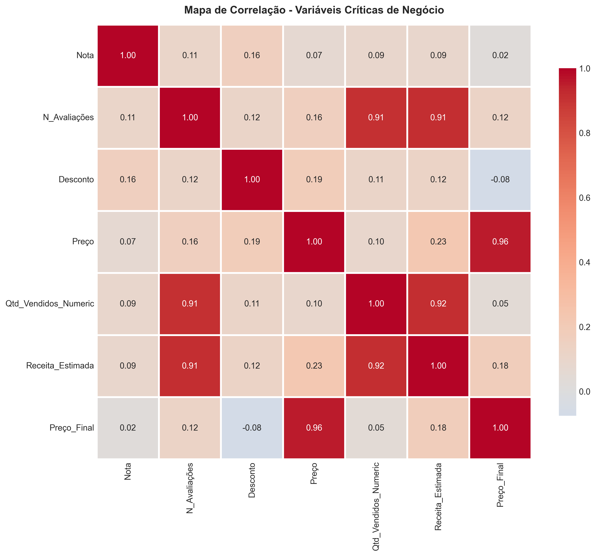
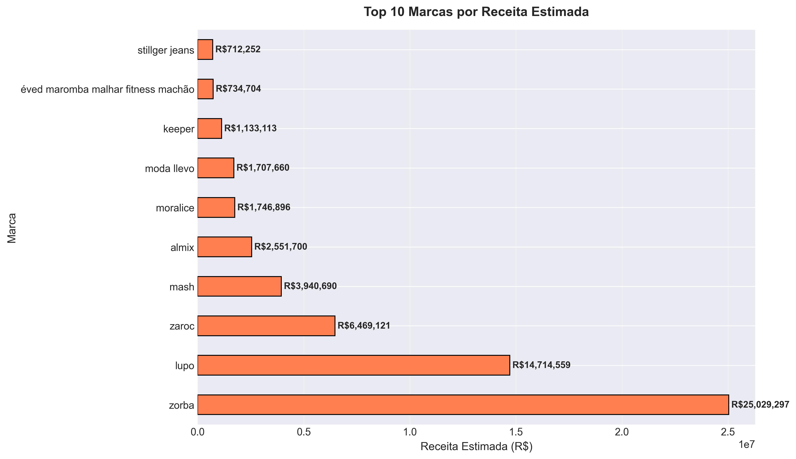
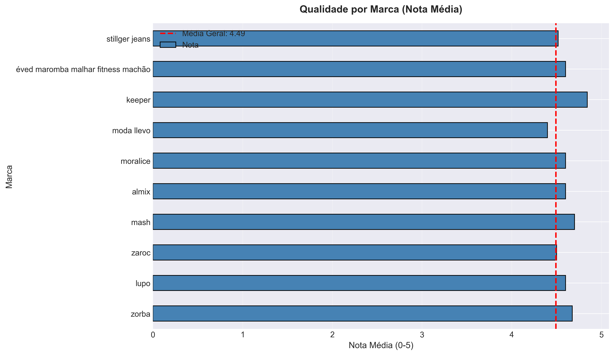
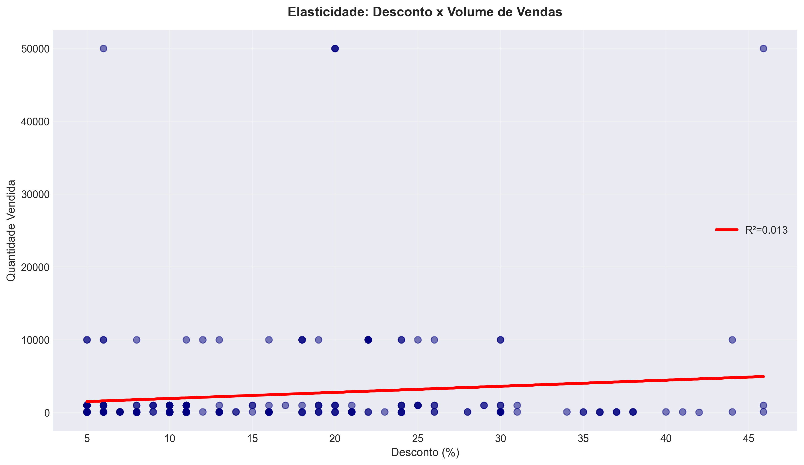
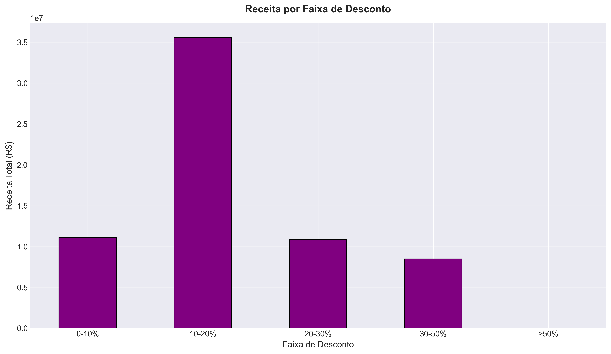
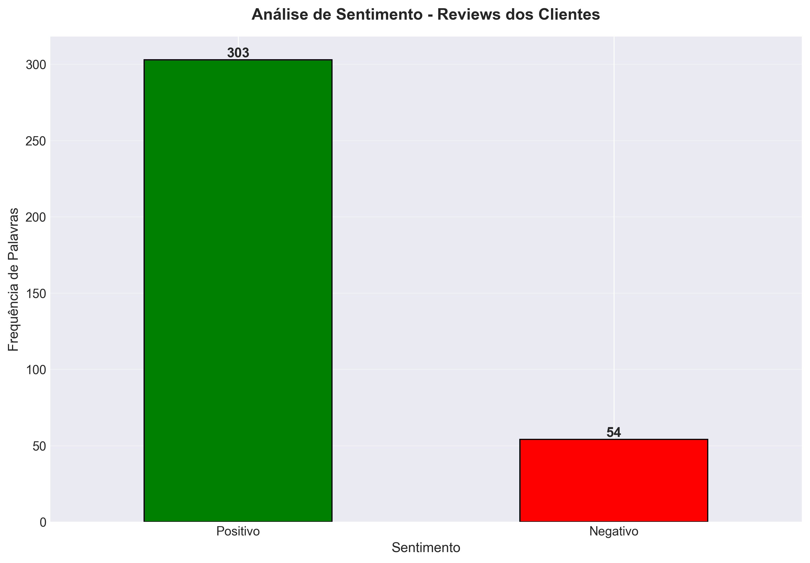
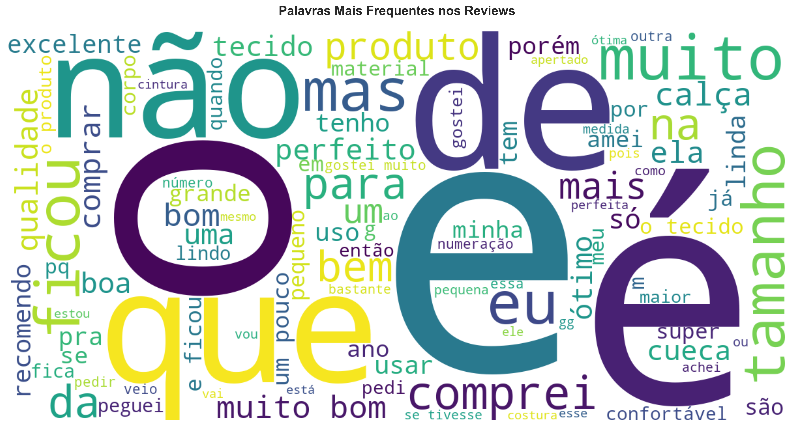
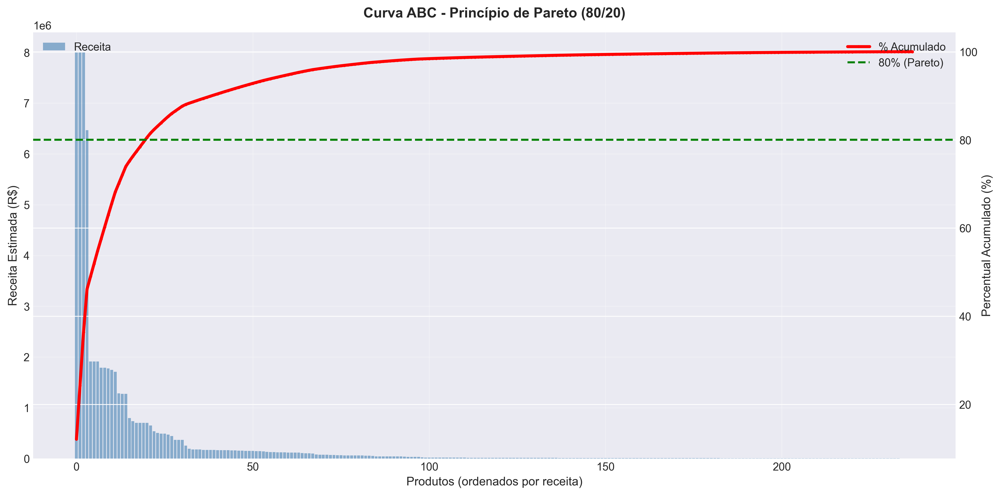

# Case de Business Intelligence: Análise Estratégica para E-commerce

_Análise desenvolvida por: Carlos Ailton Porto de Melo |[https://www.linkedin.com/in/carlos-ailton/]

---

## 1. Executive Summary (O Diagnóstico Estratégico)

Este projeto simula uma consultoria de Business Intelligence completa, movida por uma única diretriz: **transformar dados brutos em decisões de negócio lucrativas**. Em vez de apenas gerar relatórios, esta análise foi estruturada para responder a perguntas críticas de negócio, diagnosticar problemas operacionais e identificar oportunidades de crescimento para um e-commerce fictício.

O resultado final não é um dashboard, mas um **plano de ação estratégico** baseado em evidências, cobrindo desde a performance de marcas e otimização de preços até a Curva ABC de produtos e a voz do cliente.



---

## 2. O Desafio de Negócio

O desafio central era ir além da análise descritiva superficial ("o que aconteceu?") e mergulhar na análise diagnóstica ("por que aconteceu?") e prescritiva ("o que devemos fazer a respeito?"). As perguntas-chave que nortearam este projeto foram:

* **Performance de Portfólio:** Quais marcas e produtos são os verdadeiros motores da nossa receita?
* **Estratégia de Precificação:** Nossa política de descontos está canibalizando a margem ou impulsionando o volume de forma eficaz? Onde está o "sweet spot"?
* **Eficiência Operacional:** Onde estão as oportunidades de otimização de estoque e marketing (Princípio de Pareto)?
* **Voz do Cliente (VoC):** O que os dados não estruturados (reviews) nos dizem sobre a qualidade e percepção dos nossos produtos?

---

## 3. Stack Tecnológico e Metodologia

A análise foi conduzida em Python, utilizando um stack robusto para garantir profundidade e agilidade.

* **Manipulação de Dados:** `Pandas`
* **Visualização de Dados:** `Matplotlib` & `Seaborn`
* **Modelagem Estatística:** `Scikit-learn` & `SciPy`
* **Análise de Texto:** `WordCloud`
* **Ambiente de Desenvolvimento:** PyCharm com Git/GitHub para versionamento.

---

## 4. Análise e Recomendações Estratégicas

A seguir, a resposta visual e o insight gerado para cada pergunta de negócio.

### 4.1. Performance de Marcas: Onde está o Dinheiro e o Potencial?



* **Insight:** Existe uma clara concentração de receita em poucas marcas. No entanto, algumas marcas com nota média **acima da média geral** possuem baixa receita, indicando um desalinhamento entre qualidade percebida e investimento em marketing.
* **Recomendação:** Lançar campanhas de performance focadas nas marcas de "alto potencial" (alta nota, baixa receita) para capitalizar sobre a qualidade já validada pelos clientes.

### 4.2. Desconto vs. Receita: Estamos Comprando Vendas ou Lucro?



* **Insight:** A análise de regressão mostra uma correlação positiva, mas fraca, entre desconto e volume. O gráfico de receita por faixa revela que o "sweet spot" de faturamento está na faixa de 10-20% de desconto. Descontos acima de 30% não geram um aumento proporcional de receita, sugerindo queima de margem.
* **Recomendação:** Revisar a política de descontos agressivos e concentrar as promoções na faixa de 10-20% para maximizar a receita total.

### 4.3. A Voz do Cliente: O que os Reviews Revelam?



* **Insight:** Embora o sentimento geral seja positivo, a análise da WordCloud aponta para um tema recorrente de reclamações: "tamanho" (`pequeno`, `apertado`). Isso indica um problema de comunicação na descrição do produto, que pode estar gerando insatisfação e custos de devolução.
* **Recomendação:** Iniciar uma auditoria urgente nas tabelas de medidas e descrições dos produtos mais criticados para reduzir o atrito com o cliente.

### 4.4. Curva ABC: Onde Focar 80% do Esforço?


* **Insight:** A análise de Pareto confirma que uma pequena fração dos nossos produtos (Classe A) é responsável por 80% da receita.
* **Recomendação:** Direcionar 80% do orçamento de marketing de performance, gestão de estoque e otimização de SEO para os produtos de Classe A. Eles são a espinha dorsal do negócio e não podem ter ruptura de estoque.

---

## 5. Como Executar Este Projeto

Para replicar esta análise, siga os passos:

1.  Clone o repositório.
2.  Instale as dependências necessárias através do terminal:
    ```bash
    pip install pandas matplotlib seaborn numpy scipy scikit-learn wordcloud
    ```
3.  Execute o script principal:
    ```bash
    python analise_estrategica_ecommerce.py
    ```
4.  Todos os 14 gráficos estratégicos serão salvos como arquivos `.png` no diretório.
